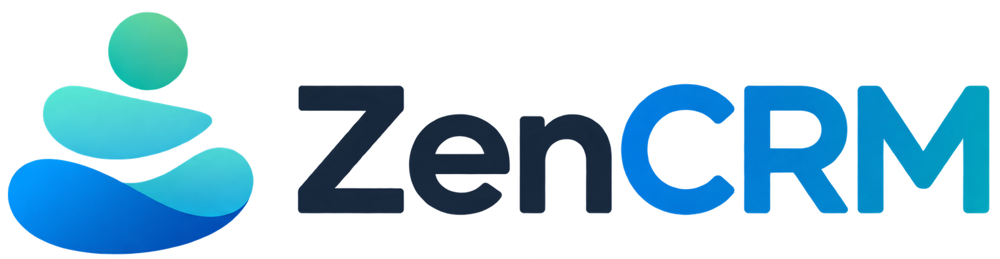
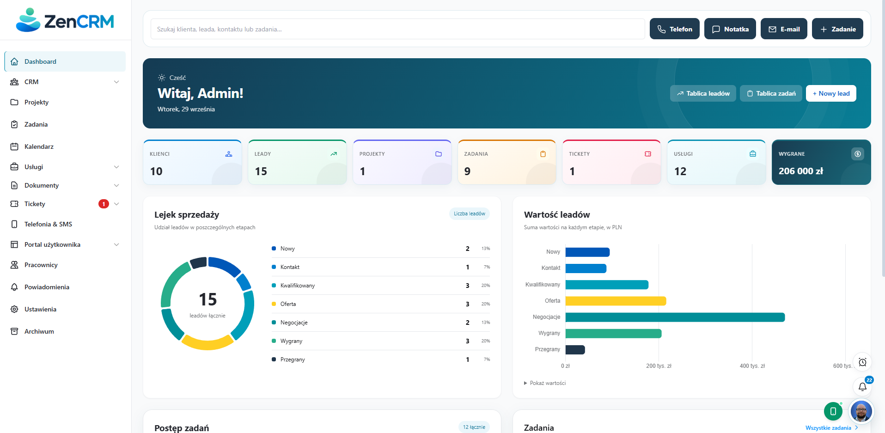
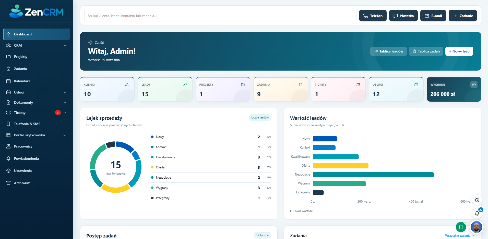
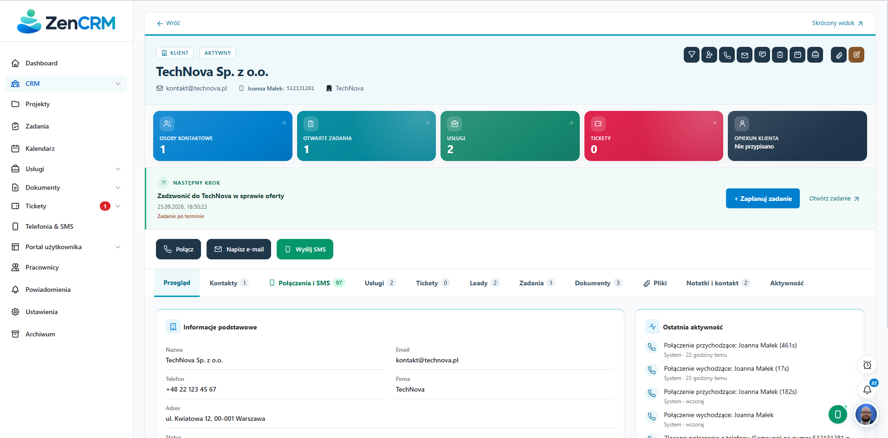
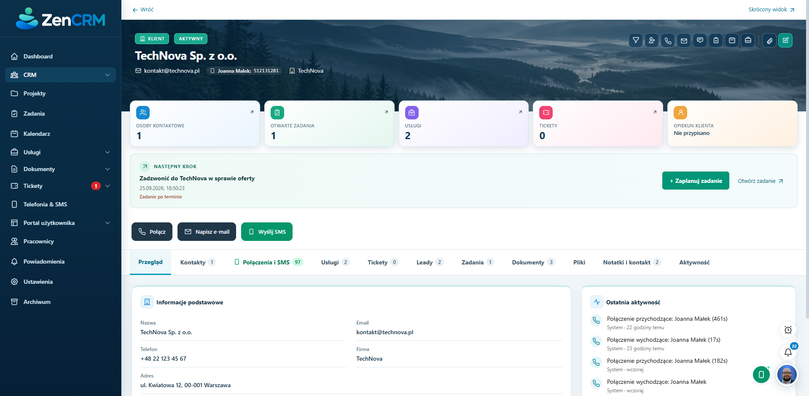
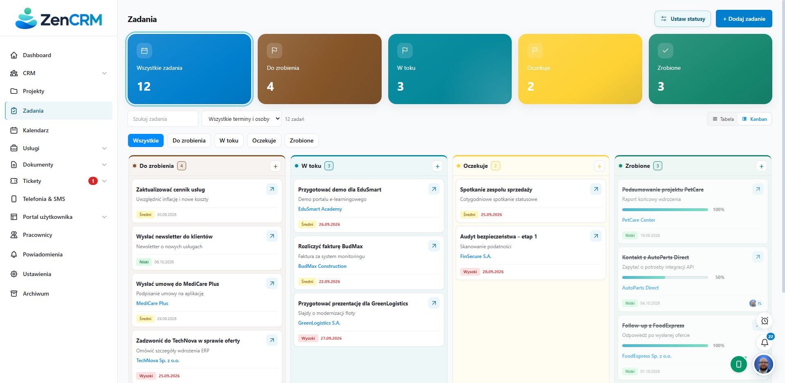

**Mniej chaosu. Więcej relacji. Wszystko w jednym CRM.**  
**Less chaos. Stronger relationships. Everything in one CRM.**

Samodzielnie hostowany CRM do sprzedaży, projektów, dokumentów i obsługi klienta.  
A self-hosted CRM for sales, projects, documents, and customer support.

[Polski](#polski) · [English](#english) · [Galeria / Gallery](#galeria--gallery) · [Zgłoś błąd / Report an issue](https://github.com/ZenCRM/ZenCRM/issues)

---

## Galeria / Gallery

Zrzuty pochodzą z katalogu <code>screens/</code>. Kliknij obraz, aby otworzyć go w pełnym rozmiarze.  
Screenshots are stored in <code>screens/</code>. Click an image to open it at full size.

| Classic — pulpit / dashboard | Modern — pulpit / dashboard |
| :---: | :---: |
|  |  |
| **Classic — karta klienta / client record** | **Modern — karta klienta / client record** |
|  |  |

**Zadania w Kanban / Tasks in Kanban**

---

## Polski

### Jeden system od pierwszego kontaktu do obsługi po sprzedaży

ZenCRM łączy dane klientów, leady, zadania, projekty, komunikację i helpdesk. Przykładowy przebieg pracy to **lead → oferta → klient → projekt lub usługa → obsługa zgłoszeń**. Każdy moduł może też działać samodzielnie, zgodnie z procesem zespołu.

| 📱 **TWOJE POŁĄCZENIA I SMS-Y PROSTO W CRM** |
| :--- |
| Koniec z ręcznym przepisywaniem historii kontaktów. Połącz swój telefon Android z ZenCRM, a zsynchronizowane połączenia i SMS-y z klientem pojawią się w jego karcie. Możesz też zlecić połączenie lub wysłać wiadomość bezpośrednio z CRM. **Nie potrzebujesz Twilio ani zewnętrznej bramki SMS** — wiadomości obsługuje Twój telefon z kompatybilną aplikacją mobilną. |

### Dwa szablony interfejsu

| Szablon | Wygląd i zastosowanie |
| --- | --- |
| **Classic — domyślny** | Jasny, uporządkowany układ z tradycyjną nawigacją i kartami rekordów. |
| **Modern** | Ciemny sidebar z delikatnym gradientem, szerszy obszar treści, odświeżone listy i Kanban oraz stonowane zdjęcia gór, lasów lub wybrzeża w nagłówkach rekordów. Tło można wybrać albo losować z kilku wariantów. |

Szablon wybierzesz w **Ustawienia → Szablony wyglądu**. Oba współpracują z trybem jasnym i ciemnym. Zrzuty obu wersji znajdziesz w [galerii](#galeria--gallery).

### Co potrafi ZenCRM?

| Obszar | Funkcje |
| --- | --- |
| **Pulpit** | Liczniki klientów, leadów, projektów, zadań i usług, wykresy lejka oraz skróty do codziennych działań. |
| **Klienci i kontakty** | Dane firm i osób, opiekunowie, powiązane kontakty, pliki, notatki i historia aktywności w jednej karcie. |
| **Leady** | Etapy sprzedaży, wartość i prawdopodobieństwo, widok tabeli i Kanban, konwersja leada na klienta oraz źródła i webhook leadów. |
| **Projekty** | Statusy, etapy, członkowie zespołu, powiązania z klientami, zadania, terminy i pliki w jednym miejscu. |
| **Zadania** | Lista i Kanban, priorytety, terminy, postęp oraz przypisanie wielu wykonawców. |
| **Kalendarz i spotkania** | Widok miesiąca i plan dnia, spotkania oraz terminy powiązane z pracą zespołu. |
| **Usługi** | Katalog usług i obsługa konkretnych realizacji przypisanych do klientów i pracowników, wraz z postępem oraz powiązanymi zadaniami. |
| **Oferty i dokumenty** | Formularze typów dokumentów, własne szablony, podgląd, generowanie PDF i publiczne linki oparte na tokenie. |
| **Telefonia i SMS** | Telefony przypisane do użytkowników, synchronizacja połączeń i wiadomości, wątki SMS, statystyki oraz zlecanie akcji na telefonie. |
| **E-mail** | Powiadomienia wysyłane przez SMTP; edytowalne tematy i treści szablonów w panelu administratora. |
| **Tickety i helpdesk** | Zgłoszenia, kategorie, reguły przydziału, samodzielna publiczna aplikacja do zgłoszeń oraz komunikacja w ramach ticketu. |
| **Portal klienta** | Oddzielne logowanie, członkowie portalu, udostępniane dane i moduły oraz wygląd przestrzeni klienta. |
| **Przypomnienia i powiadomienia** | Przypomnienia z dowolnego widoku CRM, dźwięk w aplikacji oraz opcjonalne powiadomienia push w przeglądarce. |
| **Administracja** | Role, zespoły, uprawnienia, własne i wymagane pola, wyłączanie modułów, branding, archiwum i przywracanie rekordów. |
| **Języki** | Polski i angielski w zestawie; administrator może edytować tłumaczenia i tworzyć kolejne języki w panelu. |
| **Aktualizacje** | Porównanie zainstalowanej wersji z najnowszym stabilnym wydaniem GitHub i dostęp do opisów wydań. |

### Generowanie ofert i dokumentów

| 📄 **SZABLON → PODGLĄD → PDF → LINK DO UDOSTĘPNIENIA** |
| :--- |
| Zbuduj formularz dla wybranego typu dokumentu, połącz go z własnym szablonem i wygeneruj PDF z danych wpisanych w formularzu oraz danych CRM. Gotowy plik można pobrać albo udostępnić przez link z indywidualnym tokenem. |

1. W panelu administratora utwórz typ dokumentu i określ pola jego formularza: tekst, długi tekst, liczbę, datę, pole tak/nie lub listę wyboru.
2. Przygotuj szablon w edytorze. Wstaw do niego dane z CRM i pola typu dokumentu, a następnie sprawdź podgląd.
3. Utwórz dokument lub ofertę, wypełnij formularz i powiąż wpis z klientem, a w razie potrzeby także z leadem lub usługą.
4. Wygeneruj PDF. Gotowy materiał pobierz albo udostępnij przez indywidualny link z tokenem.

Szablony i dane biznesowe pozostają w Twojej instalacji. Generowanie PDF wykorzystuje Jinja2 oraz biblioteki PDF zainstalowane po stronie serwera.

### Projekty i usługi

**Projekty** porządkują pracę wokół klienta: możesz śledzić status i etapy, dodać członków zespołu, zadania, terminy i pliki. Szczegóły projektu gromadzą powiązane informacje, więc zespół widzi postęp bez szukania go w wielu miejscach.

**Usługi** mają własny katalog, z którego tworzysz realizacje dla klientów. Do realizacji przypisujesz pracowników, kontrolujesz postęp i łączysz z nią zadania. Dzięki temu można prowadzić zarówno jednorazowe zlecenia, jak i dłuższą obsługę klienta.

### Portal klienta i aplikacja ticketowa

**Portal klienta** daje klientowi osobne logowanie do jego przestrzeni. Administrator zarządza członkami portalu, wybiera udostępniane moduły i dostosowuje wygląd. Klient może korzystać z udostępnionych mu dokumentów, ofert, usług i zgłoszeń bez dostępu do wewnętrznego panelu CRM.

**Aplikacja ticketowa / helpdesk** działa także jako osobna, publiczna strona pomocy. Klient zgłasza problem przez formularz i otrzymuje unikalny link do śledzenia sprawy. W panelu można ustawić wygląd strony, kategorie i automatyczne przypisywanie zgłoszeń do pracownika lub zespołu. Odpowiedzi i historia rozmowy pozostają przy tickecie.

### Przypomnienia i powiadomienia e-mail

Przypomnienie dodasz z dowolnego widoku CRM; może zawierać link do aktualnie otwartego elementu. O wybranej godzinie aplikacja pokazuje przypomnienie i może odtworzyć dźwięk. Dźwięk trzeba włączyć w przeglądarce; opcjonalne powiadomienia push pozwalają otrzymywać alerty także w tle, po udzieleniu zgody przeglądarce. Przypomnienie można odłożyć na później albo oznaczyć jako wykonane.

Po skonfigurowaniu **SMTP** system wysyła powiadomienia e-mail o zdarzeniach takich jak przypisanie zadania czy nowy ticket. W **Ustawienia → Szablony e-mail & SMTP** administrator edytuje temat i treść szablonów, może przywrócić wersję domyślną oraz sprawdzić połączenie z serwerem pocztowym. Użytkownik może ustawić swoje preferencje powiadomień e-mail.

### Dostosowanie systemu w panelu administratora

- **Własne pola:** dodawaj pola do wybranych modułów i zbieraj dane specyficzne dla swojej firmy; możesz też zarządzać wymaganymi polami standardowymi.
- **Moduły:** w ustawieniach menu włączaj lub wyłączaj dowolny moduł z listy oraz określaj jego widoczność dla ról. Wyłączona pozycja znika z nawigacji, a dostęp do niej jest blokowany.
- **Role i uprawnienia:** przypisuj użytkowników do ról i zespołów oraz określaj dostęp do operacji w poszczególnych modułach. Możesz także tworzyć własne role.
- **Tłumaczenia:** w **Ustawienia → Tłumaczenia** edytuj istniejące teksty polskie i angielskie albo utwórz kolejny język na podstawie jednego z nich. Własne tłumaczenia są zachowywane w bazie danych.

### Telefonia i SMS w praktyce

W **Telefonia & SMS** dodajesz urządzenie i łączysz je z aplikacją Android współpracującą z bramką CRM (SMS Manager / GoFlow) za pomocą indywidualnego tokenu. Aplikacja działa w tle telefonu i synchronizuje historię połączeń oraz wiadomości. ZenCRM wiąże ją z klientami, leadami i kontaktami po numerze telefonu. Z ich kart możesz przejrzeć wcześniejszy kontakt oraz zlecić wykonanie połączenia lub wysłanie SMS-a przez podłączony telefon. Dostęp do urządzeń i wysyłania jest powiązany z zalogowanym użytkownikiem.

### Aktualizacje

| 🔄 **AUTOMATYCZNE SPRAWDZANIE NOWYCH WYDAŃ** |
| :--- |
| Po wejściu w **Ustawienia → Aktualizacja** ZenCRM pobiera listę wydań GitHub i porównuje najnowszą stabilną wersję z wersją instalacji. Widzisz opis zmian i odnośnik do wydania. Wdrożenie nowej wersji wykonuje administrator. |

Zakładka **Ustawienia → Aktualizacja** automatycznie pobiera informacje o wydaniach z [GitHub Releases](https://github.com/ZenCRM/ZenCRM/releases) po jej otwarciu. Pokazuje wersję instalacji, najnowsze stabilne wydanie i opis zmian. **Instalacja aktualizacji nie odbywa się samoczynnie**: administrator wdraża wybrane wydanie zgodnie ze sposobem instalacji, po wykonaniu kopii danych.

Własne tłumaczenia mają pierwszeństwo przed tekstami dostarczonymi z aplikacją, a brakujące frazy korzystają z języka bazowego. Dzięki temu nowe teksty dodane wraz z wydaniem pojawiają się bez ręcznego kopiowania całego katalogu.

### Szybki start: Docker Compose

Wymagane są Docker i Docker Compose. Plik [docker-compose.yml](docker-compose.yml) używa obrazu [kosiorekmateusz/zencrm](https://hub.docker.com/r/kosiorekmateusz/zencrm). Przed uruchomieniem ustaw własne, różne wartości <code>SECRET_KEY</code> i <code>JWT_SECRET_KEY</code>.

~~~bash
docker compose pull zencrm
docker compose up -d --no-build zencrm
~~~

Otwórz **http://localhost/**. Przy pierwszym uruchomieniu w przeglądarce pojawi się formularz utworzenia administratora. Skrypt startowy przygotowuje bazę automatycznie; nie tworzy konta z domyślnym hasłem. Wolumen <code>zencrm_data</code> przechowuje bazę, a <code>zencrm_uploads</code> przesłane pliki.

Aby wdrożyć nowszy obraz po wykonaniu kopii danych:

~~~bash
docker compose pull zencrm
docker compose up -d --no-build zencrm
~~~

Wolumeny pozostają zachowane. Do przewidywalnych wdrożeń możesz zamiast <code>latest</code> wskazać konkretny tag obrazu, na przykład <code>0.9.0.2</code>.

### Uruchomienie lokalne

Wymagany jest **Python 3.11 lub nowszy**. Frontend jest serwowany przez Flask i nie wymaga osobnego procesu budowania. Linux może wymagać bibliotek systemowych do PDF, wymienionych w [Dockerfile](Dockerfile).

**Windows PowerShell**

~~~powershell
python -m venv venv
.\venv\Scripts\Activate.ps1
python -m pip install -r requirements.txt
Copy-Item .env.example .env
$env:PORT = "5000"
python run.py
~~~

**Linux / macOS**

~~~bash
python3 -m venv venv
source venv/bin/activate
python -m pip install -r requirements.txt
cp .env.example .env
PORT=5000 python run.py
~~~

W pliku <code>.env</code> zastąp przykładowe sekrety własnymi. Otwórz **http://localhost:5000/** i utwórz administratora w formularzu pierwszego uruchomienia. <code>run.py</code> służy do pracy lokalnej i włącza tryb debugowania Flask; wdrożenie kontenerowe używa Gunicorn.

### Konfiguracja, dane i bezpieczeństwo

| Zmienna | Znaczenie |
| --- | --- |
| <code>SECRET_KEY</code> | Sekret aplikacji Flask. |
| <code>JWT_SECRET_KEY</code> | Oddzielny sekret tokenów logowania. |
| <code>DATABASE_URL</code> | Adres bazy SQLAlchemy; domyślnie SQLite. |
| <code>PORT</code> | Port serwera; lokalnie w przykładach 5000, w Compose 80. |
| <code>ZENCRM_VERSION</code> | Opcjonalny identyfikator wersji; obraz Docker ustawia go podczas budowania. |

Przed wdrożeniem nowej wersji wykonaj kopię bazy i katalogu przesłanych plików. Aplikacja tworzy brakujące tabele i uzupełnia część starszych schematów przy starcie. Instalację dostępną przez Internet uruchamiaj przez HTTPS i chroń sekrety.

### Dokumentacja i współpraca

| Materiał | Zawartość |
| --- | --- |
| [Przewodnik użytkownika](docs/uzytkownik.md) | Praca z klientami, leadami, projektami, portalem i powiadomieniami. |
| [Dokumentacja API](docs/api.md) | Logowanie, endpointy i przykładowe żądania. |
| [Opis frontendu](frontend/README.md) | Widoki, moduły JavaScript i katalogi językowe. |
| [Najnowsze wydanie](https://github.com/ZenCRM/ZenCRM/releases/latest) | Opis zmian i dostępne tagi. |

Błędy i pomysły zgłaszaj przez [GitHub Issues](https://github.com/ZenCRM/ZenCRM/issues). Zmiany można proponować przez pull request.

---

## English

### One system from first contact to after-sales support

ZenCRM brings customer records, leads, tasks, projects, communication, and support together. A typical workflow is **lead → offer → client → project or service → support**, while each module can also be used on its own.

| 📱 **YOUR CALLS AND TEXTS, RIGHT IN THE CRM** |
| :--- |
| Stop copying contact history by hand. Connect your Android phone to ZenCRM and synchronized calls and texts with a client appear on their record. You can also request a call or send a message from the CRM. **No Twilio or external SMS gateway is needed** — your phone handles messaging through a compatible mobile app. |

### Two interface templates

| Template | Appearance |
| --- | --- |
| **Classic — default** | A light, structured layout with familiar navigation and record cards. |
| **Modern** | A dark sidebar with a subtle gradient, a wider content area, refined lists and Kanban, and muted mountain, forest, or coast photos behind record headers. Choose a photo or rotate among several backgrounds. |

Select a template under **Settings → Appearance templates**. Both work with light and dark mode. See the [gallery](#galeria--gallery) for screenshots of each template.

### What can ZenCRM do?

| Area | Features |
| --- | --- |
| **Dashboard** | Counts for clients, leads, projects, tasks, and services, pipeline charts, and shortcuts to frequent actions. |
| **Clients and contacts** | Company and person details, account owners, linked contacts, files, notes, and activity history in one record. |
| **Leads** | Sales stages, value and probability, table and Kanban views, lead conversion, lead sources, and a lead webhook. |
| **Projects** | Statuses, stages, team members, client links, tasks, deadlines, and files in one place. |
| **Tasks** | List and Kanban, priorities, due dates, progress, and multiple assignees. |
| **Calendar and meetings** | Month view and daily agenda for meetings and team deadlines. |
| **Services** | A service catalog and individual client deliveries assigned to team members, with progress and linked tasks. |
| **Offers and documents** | Document type forms, custom templates, preview, PDF generation, and token-based public links. |
| **Telephony and SMS** | User-owned phones, synchronized calls and messages, SMS threads, statistics, and actions queued to a phone. |
| **Email** | SMTP notifications with editable message subjects and templates in the admin panel. |
| **Tickets and helpdesk** | Requests, categories, assignment rules, a standalone public ticket app, and conversations within tickets. |
| **Customer portal** | Separate login, portal members, shared data and modules, and workspace appearance. |
| **Reminders and notifications** | Reminders from any CRM view, sound in the app, and optional browser push notifications. |
| **Administration** | Roles, teams, permissions, custom and required fields, module switches, branding, archive, and restore. |
| **Languages** | Polish and English included; administrators can edit translations and create more languages in the panel. |
| **Updates** | Compare the installed version with the latest stable GitHub release and read release notes. |

### Generate offers and documents

| 📄 **TEMPLATE → PREVIEW → PDF → SHAREABLE LINK** |
| :--- |
| Build a form for a document type, connect it to your template, and generate a PDF from the completed form and CRM data. Download the result or share it using a link with an individual token. |

1. In the admin panel, create a document type and define its form fields: text, long text, number, date, yes/no, or a selection list.
2. Create a template in the editor. Add CRM data and document type fields, then review the preview.
3. Create a document or offer, complete the form, and link the record to a client and, where relevant, a lead or service.
4. Generate a PDF. Download it or share it through an individual token-based link.

Templates and business data stay in your installation. PDF generation uses Jinja2 and server-side PDF libraries.

### Projects and services

**Projects** organize work around a client. Track status and stages, add team members, tasks, deadlines, and files. Project details bring related information together so the team can see progress in one place.

**Services** have a separate catalog from which you create individual client deliveries. Assign team members, track progress, and link tasks to a delivery. This supports both one-time work and ongoing client service.

### Customer portal and ticket app

The **customer portal** gives clients a separate login to their own workspace. Administrators manage portal members, choose which modules to share, and adjust its appearance. Clients can access shared documents, offers, services, and tickets without entering the internal CRM panel.

The **ticket app / helpdesk** can also run as a standalone public help page. Clients submit a request through a form and receive a unique link to follow its status. In the admin panel, set the page appearance, categories, and automatic assignment to a person or team. Replies and conversation history stay with the ticket.

### Reminders and email notifications

Create a reminder from any CRM view and include a link to the item you are viewing. At the selected time, the app shows the reminder and can play a sound. Browser interaction is required to enable sound; optional push notifications can deliver alerts in the background after browser permission is granted. You can snooze or dismiss a reminder.

Once **SMTP** is configured, the system sends email notifications for events such as a task assignment or a new ticket. Under **Settings → Email templates & SMTP**, administrators edit template subjects and bodies, restore defaults, and check the mail server connection. Users can set their own email notification preferences.

### Customize the CRM in the admin panel

- **Custom fields:** add fields to selected modules to collect information specific to your business; you can also manage required standard fields.
- **Modules:** enable or disable any module listed in menu settings and choose which roles can see it. A disabled entry disappears from navigation and access to it is blocked.
- **Roles and permissions:** assign users to roles and teams, and control access to actions in each module. You can also create custom roles.
- **Translations:** under **Settings → Translations**, edit existing Polish and English text or create another language based on either one. Custom translations are retained in the database.

### Telephony and SMS in practice

In **Telephony & SMS**, add a device and pair a compatible Android app (SMS Manager / GoFlow) with the CRM gateway using an individual token. The app runs in the background on your phone and synchronizes call and message history. ZenCRM links it to clients, leads, and contacts by phone number. From their records, you can review earlier conversations and request a call or send a text through the connected phone. Device access and sending permissions are tied to the signed-in user.

### Updates

| 🔄 **AUTOMATIC RELEASE CHECKS** |
| :--- |
| Opening **Settings → Updates** fetches GitHub releases and compares the latest stable version with the installed version. The screen shows release notes and a link to the release. An administrator deploys the new version. |

Opening **Settings → Updates** automatically fetches releases from [GitHub Releases](https://github.com/ZenCRM/ZenCRM/releases). It shows the installed version, the latest stable release, and its notes. **The application does not install updates unattended**: an administrator deploys the chosen release using the installation method after backing up data.

Custom translations take precedence over bundled translations, while missing phrases fall back to the base language. New text from later releases therefore appears without copying the entire catalog by hand.

### Quick start: Docker Compose

Docker and Docker Compose are required. [docker-compose.yml](docker-compose.yml) uses the published [kosiorekmateusz/zencrm](https://hub.docker.com/r/kosiorekmateusz/zencrm) image. Before starting, set your own, distinct <code>SECRET_KEY</code> and <code>JWT_SECRET_KEY</code> values.

~~~bash
docker compose pull zencrm
docker compose up -d --no-build zencrm
~~~

Open **http://localhost/**. On the first launch, the browser displays a form to create the administrator. The entrypoint prepares the database automatically; it does not create an account with a default password. The <code>zencrm_data</code> volume stores the database and <code>zencrm_uploads</code> stores uploaded files.

To deploy a newer image after backing up your data:

~~~bash
docker compose pull zencrm
docker compose up -d --no-build zencrm
~~~

The volumes are retained. For predictable deployments, you can replace <code>latest</code> with a specific image tag such as <code>0.9.0.2</code>.

### Run locally

You need **Python 3.11 or newer**. Flask serves the frontend without a separate build step. On Linux, PDF generation may require the system libraries listed in the [Dockerfile](Dockerfile).

**Windows PowerShell**

~~~powershell
python -m venv venv
.\venv\Scripts\Activate.ps1
python -m pip install -r requirements.txt
Copy-Item .env.example .env
$env:PORT = "5000"
python run.py
~~~

**Linux / macOS**

~~~bash
python3 -m venv venv
source venv/bin/activate
python -m pip install -r requirements.txt
cp .env.example .env
PORT=5000 python run.py
~~~

Replace the sample secrets in <code>.env</code> with your own. Open **http://localhost:5000/** and create the administrator through the first-run form. <code>run.py</code> is intended for local work and enables Flask debug mode; the container deployment uses Gunicorn.

### Configuration, data, and security

| Variable | Purpose |
| --- | --- |
| <code>SECRET_KEY</code> | Flask application secret. |
| <code>JWT_SECRET_KEY</code> | Separate secret for login tokens. |
| <code>DATABASE_URL</code> | SQLAlchemy database URL; SQLite by default. |
| <code>PORT</code> | Server port; 5000 in the local examples and 80 in Compose. |
| <code>ZENCRM_VERSION</code> | Optional version identifier; the Docker image sets it at build time. |

Back up the database and uploaded files before deploying a new release. The application creates missing tables and updates some older schemas at startup. Use HTTPS for an Internet-facing installation and protect your secrets.

### Documentation and contributions

| Resource | Contents |
| --- | --- |
| [User guide (Polish)](docs/uzytkownik.md) | Clients, leads, projects, the portal, and notifications. |
| [API reference (Polish)](docs/api.md) | Login, endpoints, and example requests. |
| [Frontend notes (Polish)](frontend/README.md) | Views, JavaScript modules, and language catalogs. |
| [Latest release](https://github.com/ZenCRM/ZenCRM/releases/latest) | Release notes and available tags. |

Report bugs and ideas through [GitHub Issues](https://github.com/ZenCRM/ZenCRM/issues). Code changes can be proposed in a pull request.
