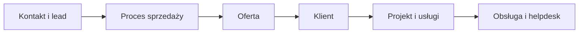
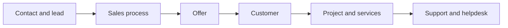

<div align="center">


### Mniej chaosu. Więcej relacji. Wszystko w jednym CRM.

Sprzedaż, projekty i obsługa klienta — od pierwszego kontaktu po realizację usługi.

**Na Twoim serwerze. W Twoim języku. W rytmie Twojego zespołu.**

[](https://zencrmdemo.tw5.org/)

[](https://www.python.org/)
[](https://flask.palletsprojects.com/)
[](https://alpinejs.dev/)
[](docker-compose.yml)

[Strona projektu](https://zencrm.pl) · [Instalacja](#instalacja-przez-docker-compose) · [Dokumentacja](#dokumentacja) · [Zgłoś błąd](https://github.com/ZenCRM/ZenCRM/issues)

[Polski](#polski) · [English](#english)

</div>

---

<a href="https://zencrm.pl/screens/1a.png">
  
</a>

<p align="center"><sub>ZenCRM w akcji · Kliknij zrzut ekranu, aby zobaczyć go w pełnym rozmiarze.</sub></p>

## Polski

### Twoje centrum pracy z klientem

ZenCRM łączy informacje o klientach, proces sprzedaży i codzienną pracę zespołu. Prowadź leady na tablicy Kanban, przygotowuj oferty, planuj realizację i obsługuj zgłoszenia w jednej aplikacji.

- **Od leada do klienta** — konwersja szansy sprzedaży przenosi powiązane kontakty, zadania i dokumenty.
- **Wspólna praca, jasne przypisania** — projekty, zespoły i zadania ze statusem każdego wykonawcy.
- **Kontakt także po sprzedaży** — portal klienta, helpdesk i historia aktywności przy rekordach.
- **Własna instalacja** — Docker Compose lub Python, domyślnie z bazą SQLite.
- **Wygodny interfejs** — język polski i angielski oraz jasny i ciemny motyw.

### Możliwości

| Obszar | Co możesz zrobić |
| --- | --- |
| 🤝 **Klienci i kontakty** | Gromadź dane firm i osób, przypisuj opiekunów i przeglądaj historię współpracy. |
| 🎯 **Leady i Kanban** | Zarządzaj etapami sprzedaży, wartością szans i prawdopodobieństwem zamknięcia. |
| ✅ **Projekty i zadania** | Organizuj etapy pracy, członków projektu i zadania wielu wykonawców. |
| 📅 **Spotkania i kalendarz** | Planuj spotkania i przeglądaj terminy w kalendarzu. |
| 🛠️ **Usługi i katalog** | Utrzymuj katalog usług i prowadź konkretne realizacje z przypisanymi osobami. |
| 📄 **Oferty i dokumenty** | Pracuj na szablonach, generuj PDF i udostępniaj materiały przez linki z tokenem. |
| 🎫 **Helpdesk** | Obsługuj tickety, konfiguruj kategorie oraz reguły automatycznego przydziału. |
| 🌐 **Portal klienta** | Zarządzaj członkami portalu, udostępnianymi modułami i wyglądem przestrzeni. |
| 📱 **Telefonia i SMS** | Po podłączeniu urządzenia synchronizuj historię połączeń i wiadomości. |
| 📊 **Dashboard** | Sprawdzaj metryki i wykresy na pulpicie aplikacji. |
| ⚙️ **Administracja** | Zarządzaj rolami, zespołami, uprawnieniami, polami własnymi i archiwum. |

### Jak to się łączy?



Przykładowy przebieg pracy: od pozyskania kontaktu po obsługę po sprzedaży. Poszczególne moduły możesz wykorzystywać zgodnie z procesem swojego zespołu.

### Technologia

| Warstwa | Rozwiązanie |
| --- | --- |
| Backend | Python, Flask, SQLAlchemy, Flask-Migrate |
| Interfejs | Alpine.js, widoki Jinja, JavaScript i CSS |
| Baza danych | Domyślnie SQLite; połączenie konfigurowane przez `DATABASE_URL` |
| Logowanie do CRM | Tokeny JWT przez Flask-JWT-Extended |
| Dokumenty | Jinja2, WeasyPrint i xhtml2pdf |
| Uruchomienie w kontenerze | Docker Compose i Gunicorn |

Frontend jest serwowany przez Flask i **nie wymaga osobnego procesu budowania**. Node.js jest potrzebny wyłącznie do testów frontendu.

### Instalacja lokalna

Wymagany jest **Python 3.11 lub nowszy**. Domyślna baza to SQLite. Node.js jest potrzebny wyłącznie do testów frontendu. Na Linuxie generowanie PDF przez WeasyPrint może wymagać bibliotek systemowych, takich jak Pango i HarfBuzz; ich lista znajduje się w `Dockerfile`.

W katalogu projektu wykonaj:

**Windows PowerShell**

```powershell
python -m venv venv
.\venv\Scripts\Activate.ps1
python -m pip install -r requirements.txt
Copy-Item .env.example .env
```

**Linux / macOS**

```bash
python3 -m venv venv
source venv/bin/activate
python -m pip install -r requirements.txt
cp .env.example .env
```

W `.env` zastąp przykładowe wartości `SECRET_KEY` i `JWT_SECRET_KEY` dwoma różnymi, długimi losowymi sekretami. Następnie utwórz pierwsze konto administratora i uruchom aplikację:

**Windows PowerShell**

```powershell
python seed.py
$env:PORT = "5000"
python run.py
```

**Linux / macOS**

```bash
python seed.py
PORT=5000 python run.py
```

Otwórz **http://localhost:5000/**. Skrypt `seed.py` tworzy konto `admin@zencrm.pl` z hasłem `admin123`, jeśli baza nie zawiera żadnych użytkowników. Istniejące konta i hasła pozostają bez zmian. **Zmień hasło po pierwszym logowaniu.** `run.py` uruchamia serwer deweloperski Flask z włączonym debugowaniem. Jeśli nie ustawisz `PORT`, użyje portu 80.

### Instalacja przez Docker Compose

Plik `docker-compose.yml` uruchamia opublikowany obraz `kosiorekmateusz/zencrm:latest`. Przed startem wpisz w nim własne wartości `SECRET_KEY` i `JWT_SECRET_KEY`. Domyślnie aplikacja będzie dostępna na porcie 80:

```bash
docker compose up -d
docker compose exec zencrm python seed.py
```

Obrazy zbudowane z aktualnego kodu uruchamiają `seed.py` automatycznie przy starcie kontenera. Ręczne polecenie powyżej jest potrzebne tylko dla starszych obrazów. Aby uzyskać tę poprawkę we własnym obrazie, przebuduj go i odtwórz kontener z zachowaniem wolumenów.

Otwórz **http://localhost/**, zaloguj się kontem administratora podanym wyżej i od razu zmień hasło. Wolumen `zencrm_data` przechowuje bazę w `/app/instance`, a `zencrm_uploads` przesłane pliki w `/app/uploads`. Compose pobiera gotowy obraz; aby uruchomić własny kod po zmianach w repozytorium, zbuduj obraz lokalnie i wskaż go w konfiguracji Compose.

### Konfiguracja i dane

| Zmienna | Opis | Przykład |
| --- | --- | --- |
| `SECRET_KEY` | Sekret aplikacji Flask | losowy ciąg |
| `JWT_SECRET_KEY` | Sekret tokenów logowania | inny losowy ciąg |
| `DATABASE_URL` | Adres bazy SQLAlchemy | `sqlite:///zencrm.db` |
| `PORT` | Port serwera | `5000` lokalnie |

Przy uruchomieniu aplikacja tworzy brakujące tabele. Przed aktualizacją instalacji z danymi wykonaj kopię bazy i katalogu `uploads/` oraz sprawdź migracje w `migrations/`. Instalację dostępną z Internetu uruchamiaj za HTTPS i chroń sekrety z `.env`.

### Dokumentacja

| Materiał | Zawartość |
| --- | --- |
| [Przewodnik użytkownika](docs/uzytkownik.md) | Praca z modułami, portal klienta, role i powiadomienia. |
| [Dokumentacja API](docs/api.md) | Uwierzytelnianie, mapa endpointów i przykłady żądań. |
| [Frontend](frontend/README.md) | Struktura widoków, moduły JavaScript, tłumaczenia i testy. |
| [Dockerfile](Dockerfile) | Budowanie obrazu i zależności systemowe. |

### Praca nad projektem

Pobierz kod i przejdź do katalogu projektu, a następnie wykonaj kroki instalacji lokalnej:

```bash
git clone https://github.com/ZenCRM/ZenCRM.git
cd ZenCRM
```

Najważniejsze katalogi:

```text
ZenCRM/
├── app/               # Backend: API, modele, schematy i usługi
├── frontend/          # Widoki, moduły JavaScript, style i tłumaczenia
├── docs/              # Przewodnik użytkownika i dokumentacja API
├── migrations/        # Migracje bazy danych
├── tests/             # Testy backendu i frontendu
├── run.py             # Uruchomienie aplikacji
└── seed.py            # Utworzenie pierwszego administratora
```

Po instalacji zależności, w aktywnym środowisku Python, uruchom testy z katalogu głównego repozytorium:

```bash
python -m unittest discover -s tests
node tests/test_frontend.cjs
```

### Pomysły i współpraca

Masz pomysł na usprawnienie albo znalazłeś błąd? [Otwórz zgłoszenie](https://github.com/ZenCRM/ZenCRM/issues). Opisz oczekiwane zachowanie, kroki odtworzenia i środowisko uruchomienia; przy problemach z interfejsem dołącz zrzut ekranu bez danych klientów.

Zmiany w kodzie możesz zaproponować przez pull request. Dołącz opis rozwiązania i wyniki odpowiednich testów. Przy zmianach interfejsu pamiętaj o obu językach oraz jasnym i ciemnym motywie.

---

<div align="center">

**ZenCRM · Zadbaj o relacje. Uporządkuj pracę.**

[Strona projektu](https://zencrm.pl) · [Zgłoszenia i pomysły](https://github.com/ZenCRM/ZenCRM/issues) · [Powrót na górę](#zencrm)

Jeśli ZenCRM przydaje się w Twojej pracy, zostaw ⭐ na GitHubie.

</div>
---

## English

<div align="center">


### Less chaos. Stronger relationships. Everything in one CRM.

Sales, projects, and customer service — from the first contact to service delivery.

**On your server. In your language. At your team's pace.**

[](https://zencrmdemo.tw5.org/)

[](https://www.python.org/)
[](https://flask.palletsprojects.com/)
[](https://alpinejs.dev/)
[](docker-compose.yml)

[Website](https://zencrm.pl) · [Installation](#docker-compose-installation) · [Documentation](#documentation) · [Report a bug](https://github.com/ZenCRM/ZenCRM/issues)

[Polski](#polski) · [English](#english)

</div>

---

<a href="https://zencrm.pl/screens/1a.png">
  
</a>

<p align="center"><sub>ZenCRM in action · Click the screenshot to view it at full size.</sub></p>

### Your customer management hub

ZenCRM brings customer information, your sales process, and your team's daily work together. Manage leads on a Kanban board, prepare offers, plan delivery, and handle support tickets in one application.

- **From lead to customer** — converting a sales opportunity transfers its linked contacts, tasks, and documents.
- **Teamwork with clear assignments** — projects, teams, and tasks with individual statuses for each assignee.
- **Stay connected after the sale** — a customer portal, helpdesk, and activity history on records.
- **Your own installation** — Docker Compose or Python, with SQLite by default.
- **A comfortable interface** — Polish and English, with light and dark themes.

### Features

| Area | What you can do |
| --- | --- |
| 🤝 **Clients and contacts** | Store company and individual details, assign account owners, and review relationship history. |
| 🎯 **Leads and Kanban** | Manage sales stages, opportunity values, and closing probabilities. |
| ✅ **Projects and tasks** | Organize work stages, project members, and tasks with multiple assignees. |
| 📅 **Meetings and calendar** | Schedule meetings and view dates in the calendar. |
| 🛠️ **Services and catalog** | Maintain a service catalog and manage individual deliveries with assigned team members. |
| 📄 **Offers and documents** | Work with templates, generate PDFs, and share materials through token-based links. |
| 🎫 **Helpdesk** | Handle tickets, configure categories, and set automatic assignment rules. |
| 🌐 **Customer portal** | Manage portal members, shared modules, and the appearance of their workspace. |
| 📱 **Telephony and SMS** | Connect a device to synchronize call and message history. |
| 📊 **Dashboard** | Review metrics and charts on the application dashboard. |
| ⚙️ **Administration** | Manage roles, teams, permissions, custom fields, and the archive. |

### How does it fit together?



An example workflow from acquiring a contact to support after the sale. Use individual modules to suit your team's process.

### Technology

| Layer | Solution |
| --- | --- |
| Backend | Python, Flask, SQLAlchemy, Flask-Migrate |
| Interface | Alpine.js, Jinja views, JavaScript, and CSS |
| Database | SQLite by default; connection configured through `DATABASE_URL` |
| CRM authentication | JWT tokens through Flask-JWT-Extended |
| Documents | Jinja2, WeasyPrint, and xhtml2pdf |
| Container deployment | Docker Compose and Gunicorn |

The frontend is served by Flask and **requires no separate build step**. Node.js is only needed for frontend tests.

### Local installation

You need **Python 3.11 or newer**. SQLite is the default database. Node.js is only needed for the frontend tests. On Linux, PDF generation with WeasyPrint may require system libraries such as Pango and HarfBuzz; see `Dockerfile` for the package list.

Run these commands from the project directory:

**Windows PowerShell**

```powershell
python -m venv venv
.\venv\Scripts\Activate.ps1
python -m pip install -r requirements.txt
Copy-Item .env.example .env
```

**Linux / macOS**

```bash
python3 -m venv venv
source venv/bin/activate
python -m pip install -r requirements.txt
cp .env.example .env
```

In `.env`, replace the sample `SECRET_KEY` and `JWT_SECRET_KEY` with two different, long random secrets. Then create the initial administrator account and start the application:

**Windows PowerShell**

```powershell
python seed.py
$env:PORT = "5000"
python run.py
```

**Linux / macOS**

```bash
python seed.py
PORT=5000 python run.py
```

Open **http://localhost:5000/**. If the database contains no users, `seed.py` creates the account `admin@zencrm.pl` with password `admin123`. Existing accounts and passwords remain unchanged. **Change this password after your first login.** `run.py` starts Flask's development server with debugging enabled. Without `PORT`, it listens on port 80.

### Docker Compose installation

The included `docker-compose.yml` uses the published `kosiorekmateusz/zencrm:latest` image. Set your own `SECRET_KEY` and `JWT_SECRET_KEY` values in that file before starting. The default host port is 80:

```bash
docker compose up -d
docker compose exec zencrm python seed.py
```

Open **http://localhost/**, sign in with the administrator account above, and change its password immediately. The `zencrm_data` volume stores the database in `/app/instance`; `zencrm_uploads` stores uploaded files in `/app/uploads`. Compose pulls a published image. To run changes from this repository, build a local image and reference it in your Compose configuration.

Images built from the current source run `seed.py` automatically at container startup. The manual command above is only needed for older images. Rebuild your image and recreate the container while keeping its volumes to apply this fix.

### Configuration and data

| Variable | Purpose | Example |
| --- | --- | --- |
| `SECRET_KEY` | Flask application secret | random string |
| `JWT_SECRET_KEY` | Login token secret | a different random string |
| `DATABASE_URL` | SQLAlchemy database URL | `sqlite:///zencrm.db` |
| `PORT` | Server port | `5000` locally |

The application creates missing tables on startup. Before updating an installation with existing data, back up the database and `uploads/` directory and review the migrations in `migrations/`. Use HTTPS for an Internet-facing installation and protect the secrets in `.env`.


### Documentation

| Resource | Contents |
| --- | --- |
| [User guide (Polish)](docs/uzytkownik.md) | Working with modules, the customer portal, roles, and notifications. |
| [API reference (Polish)](docs/api.md) | Authentication, endpoint map, and request examples. |
| [Frontend (Polish)](frontend/README.md) | View structure, JavaScript modules, translations, and tests. |
| [Dockerfile](Dockerfile) | Image build and system dependencies. |

### Development

Clone the code and enter the project directory, then follow the local installation steps:

```bash
git clone https://github.com/ZenCRM/ZenCRM.git
cd ZenCRM
```

Key directories:

```text
ZenCRM/
├── app/               # Backend: API, models, schemas, and services
├── frontend/          # Views, JavaScript modules, styles, and translations
├── docs/              # User guide and API reference
├── migrations/        # Database migrations
├── tests/             # Backend and frontend tests
├── run.py             # Application entry point
└── seed.py            # Initial administrator creation
```

After installing dependencies, run the tests from the repository root with your Python environment activated:

```bash
python -m unittest discover -s tests
node tests/test_frontend.cjs
```

### Ideas and contributions

Have an improvement in mind or found a bug? [Open an issue](https://github.com/ZenCRM/ZenCRM/issues). Describe the expected behavior, steps to reproduce, and your runtime environment; for interface issues, include a screenshot without customer data.

You can propose code changes through a pull request. Include a description of the solution and results of the relevant tests. For interface changes, remember both languages and the light and dark themes.

---

<div align="center">

**ZenCRM · Build relationships. Organize your work.**

[Website](https://zencrm.pl) · [Issues and ideas](https://github.com/ZenCRM/ZenCRM/issues) · [Back to English](#english)

If ZenCRM helps you in your work, give it a ⭐ on GitHub.

</div>
